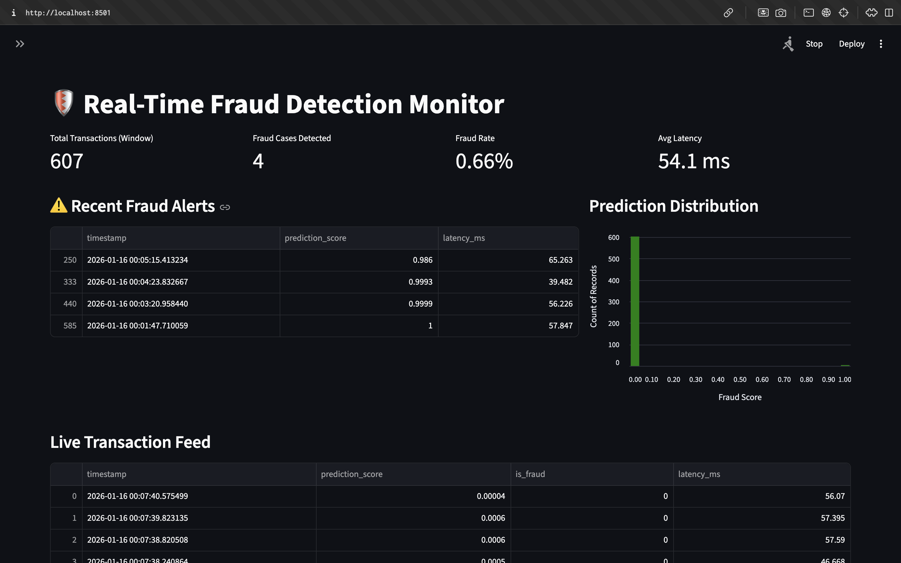

---

## Table of Contents

1. [Executive Summary](#1-executive-summary)
2. [Technical Stack & Engineering Principles](#2-technical-stack--engineering-principles)
3. [Operational Guide: Reproducing the Results](#3-operational-guide-reproducing-the-results)
4. [Architecture & System Design](#4-architecture--system-design)
5. [Performance Deep Dive: The Model](#5-performance-deep-dive-the-model)
6. [Production Readiness & Next Steps](#6-production-readiness--next-steps)

## 1. Executive Summary

This repository presents an end-to-end Machine Learning Engineering pipeline designed to detect fraudulent credit card transactions in real-time. The project goes beyond simple model training by implementing a full MLOps lifecycle: reproducible training pipelines, a scalable inference API, simulated production traffic, and live system monitoring.

The system addresses the core challenge of extreme class imbalance (0.17% fraud rate) by prioritizing Precision as the key business metric, minimizing operational friction while maintaining high detection rates. The final deployed model achieves a Precision of 88.89% and an ROC-AUC of 0.94 on unseen test data.


*Figure 1: The live monitoring dashboard visualizing real-time fraud alerts, prediction distributions, and system latency.*

---

## 2. Technical Stack & Engineering Principles

This project adheres to professional software engineering standards, emphasizing modularity, reproducibility, and separation of concerns.

-   **Languages & Libraries:** Python 3.11, TensorFlow/Keras, Scikit-learn, Pandas, Flask, Streamlit, SQLite.
-   **Hardware Compatibility:** Specifically optimized for Apple Silicon (M1/M2/M3) architecture using `tensorflow-macos` and `tensorflow-metal`.
-   **Architecture:**
    -   **Training Pipeline (`src/`):** Modular Python scripts for data ingestion, preprocessing (standard scaling), and model training.
    -   **Serving Layer (`serving/`):** A Flask-based REST API for real-time inference that logs predictions to a persistent store.
    -   **Monitoring Layer (`monitoring/`):** A Streamlit dashboard for visualizing system health, model drift, and operational metrics.
    -   **Configuration (`config/`):** Centralized YAML configuration for hyperparameters, file paths, and thresholds.
-   **Reproducibility:** A dedicated `setup_data.py` script automates data ingestion from Kaggle, and a `requirements.txt` ensures environment consistency.

---

## 3. Operational Guide: Reproducing the Results

To reproduce this system locally, follow these steps.

1.  **Clone the Repository:**
    ```bash
    git clone https://github.com/ramdevmurali/realtime-fraud-detection-system.git
    cd realtime-fraud-detection-system
    ```

2.  **Initialize Environment:**
    The project requires Python 3.11 to ensure compatibility with TensorFlow bindings on macOS.
    ```bash
    python3.11 -m venv venv
    source venv/bin/activate
    pip install -r requirements.txt
    ```

3.  **Data Ingestion:**
    Execute the setup script to download the dataset directly from Kaggle and place it in the correct raw data directory.
    ```bash
    python src/setup_data.py
    ```

4.  **Execute Training Pipeline:**
    Run the pipeline to preprocess data, train the MLP model, evaluate metrics, and serialize the artifacts (`cfd_model.h5` and `scaler.pkl`).
    ```bash
    # Required flag for macOS Apple Silicon concurrency safety
    export OBJC_DISABLE_INITIALIZE_FORK_SAFETY=YES
    python train_pipeline.py
    ```

5.  **Launch the Real-Time System:**
    The system requires three separate terminal instances running concurrently:

    *   **Terminal 1 (The API):** Hosts the model.
        ```bash
        export OBJC_DISABLE_INITIALIZE_FORK_SAFETY=YES
        python serving/api.py
        ```
    *   **Terminal 2 (The Simulator):** Generates synthetic traffic from the test set.
        ```bash
        python serving/simulator.py
        ```
    *   **Terminal 3 (The Dashboard):** Visualizes the results.
        ```bash
        export OBJC_DISABLE_INITIALIZE_FORK_SAFETY=YES
        streamlit run monitoring/dashboard.py
        ```

---

## 4. Architecture & System Design

The project is structured to mimic a production microservices environment.

### Data Flow
1.  **Ingestion:** The `src/data_loader.py` module handles raw CSV ingestion and performs a stratified Train/Validation/Test split to preserve the fraud ratio.
2.  **Preprocessing:** A `StandardScaler` is fitted on the training set only. This scaler object is serialized (`scaler.pkl`) to ensure the inference API transforms incoming production data exactly as the model expects.
3.  **Inference:** The Flask API (`serving/api.py`) exposes a `/predict` endpoint. It receives JSON payloads, applies the saved scaler, generates a fraud probability score, and logs metadata (timestamp, input, score, latency) to an SQLite database.
4.  **Observability:** The Streamlit dashboard (`monitoring/dashboard.py`) polls the SQLite database to compute near real-time metrics, serving as a "Control Tower" for stakeholders.

---

## 5. Performance Deep Dive: The Model

The model architecture is a Multi-Layer Perceptron (MLP) optimized for binary classification on imbalanced tabular data.

**Training Configuration:**
*   **Optimizer:** Adam (Learning Rate: 0.001)
*   **Loss Function:** Binary Cross-Entropy
*   **Regularization:** Dropout (0.2) and Early Stopping (Patience: 5)

**Final Metrics (Test Set):**
*   **Precision:** 88.89%
*   **Recall:** 73.47%
*   **ROC-AUC:** 0.9432
*   **Accuracy:** 99.94%

**Analysis:**
The naive accuracy of 99.94% is misleading due to the class imbalance. The success of this model is defined by the **Precision score of ~89%**. In a fraud detection context, false positives (flagging a legitimate transaction as fraud) cause significant customer friction. By optimizing for Precision, the system ensures that when an alert is triggered, there is a very high probability of actual fraud, making the system operationally viable for manual review teams.

---

## 6. Production Readiness & Next Steps

While functional, several enhancements would be required for a large-scale commercial deployment:

1.  **Containerization:** Dockerize the API and Dashboard services to ensure consistent deployment across environments (Kubernetes/AWS ECS).
2.  **Database Migration:** Migrate from SQLite to a production-grade database (PostgreSQL or TimescaleDB) to handle high-throughput logging without locking issues.
3.  **API Security:** Implement API Key authentication and HTTPS encryption for the Flask endpoint.
4.  **Testing Suite:** Implement `pytest` unit tests for data validation and model inference shape checks.